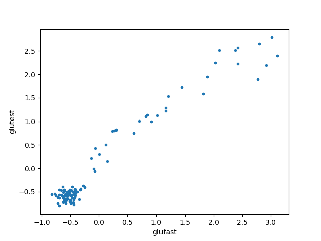

# Sample Statistics and Gaussians Exercise

### Exercise 1: Mean and Variance
This exercise first explores sample statistics like mean and variance.
It continues with the definition of the gaussian distributions.
It ends with applying gaussian mixture models (gmm) and the expectation-maximization algorithm used to optimize gmm.

- To get started, take a look at the `src/sample_mean_corr_rhein.py` file.

Implement functions to compute sample mean and the standard deviation.
Use

$$ \hat{\mu} = \frac{1}{n} \sum_{i=1}^n x_i , $$

to calculate the mean and 

$$ \hat{\sigma} = \sqrt{\frac{1}{n-1} \sum_{i=1}^n (x_i - \bar{x})^2} $$

to compute the standard deviation. $x \in \mathbb{R}$ denotes individual sample elements, and $n \in \mathbb{N}$ the size of the sample.

Return to the Rhine data-set. Load the data from `./data/pegel.tab`. Compute the water level mean and standard deviation before and after the year 2000.

### Exercise 2: Autocorrelation
Implement autocorrelation. Finish the `auto_corr` function. It should implement the engineering version without the normalization

$$        c_{k} = \sum_{t=1}^{N-k} x_t x_{t + k} .$$

Once you have checked your implementation using `nox -s test`, you can use `np.correlate` for efficieny. Plot the autocorrelation for the rhine level measurements since 2000.
Normalize your data via

$$ x_{\text{norm}} = \frac{x - \hat{\mu}}{\hat{\sigma}} ,$$

Before running the autocorrelation computation. Compare the autocorrelation to a random signal from `np.random.randn` by plotting both results with `plt.plot`.

### Exercise 3: Distributions

- Consider the `src/plot_gaussian.py` module. Implement the `gaussian_pdf` function.

In one dimension gaussian probability density function is defined as

$$\phi_1(x | \mu, \sigma) = \frac{1}{\sqrt{2\pi \sigma^2}} \exp({-\frac{1}{2}(\frac{x - \mu}{\sigma})^2}) .$$

$\pi \in \mathbb{R}$ denotes Pi, $\mu \in \mathbb{R}$ the mean and $\sigma \in \mathbb{R}$ the standard deviation for a random variable $X$. $e^x$ denotes the exponential function. $X$ having a gaussian pdf is described as gaussion or normal distribution $\mathcal{N}$. Explore the behavior of $\mathcal{N}(\mu, \sigma)$ for different values of $\mu$ and $\sigma$.

- Consider the `src/mixture_concpets.py` module. 
Implement a two-dimensional gaussian pdf following,

$$ \phi_2(\mathbf{x} | \mu_g, \Sigma_g) = \frac{1}{\sqrt{(2\pi)^2 \| \Sigma_g \|}} \exp({-\frac{1}{2}(\mathbf{x}-\mu_g)^T \Sigma_g^{-1}(\mathbf{x}-\mu_g)}).$$

$\mu_g \in \mathbb{R}^2$ denotes the two dimensional mean vector, $\Sigma_g \in \mathbb{R}^{2\times2}$ the covariance matrix, $^{-1}$ the matrix inverse, $T$ the transpose and $g \in \mathbb{N}$ the number of the distrubtion, which will be important later. 
Plot a 2d-bell curve with $\mu_1 = [-1.5, 2]$ and $\Sigma_1 = [[1, 0], [0, 1]]$ using the `plt.imshow` function. `np.linspace` and `np.meshgrid` will help you. 

### Exercise 4: Gaussian mixture models (optional)

We can use bell-curve sums for classification! A Gaussian mixture model has the density

$$ f(\mathbf{x}| \theta)  = \sum_{g=1}^G \rho_g \phi(\mathbf{x}|\mu_g, \Sigma_g).$$

With the normal distribution $\phi$ defined as before. $\rho_g$ denotes the global probability with which the data value could originate from gaussian $g$. $g$ counts all gaussians, and $G$ is the total number of Gaussians in the mix. We will use two. $\phi$ denotes the parameters $\mu_g$ and $\Sigma_g$.

After guessing an initial choice for all $\hat{\mu}_g$ and $\hat{\Sigma}_g$,

$$ \hat{z}_{ig} = \frac{\rho_g \phi(\mathbf{x_i}| \hat{\mu}_g, \hat{\Sigma}_g)}{\sum_{h=1}^G \rho_h \phi(\mathbf{x_i}| \hat{\mu}_h, \hat{\Sigma}_h) }  $$

tells us the probability with which point $x_i$ came from gaussian $g$. The equation above allows you to implement the function `get_classification` in `src/mixture_concepts.py`.
The `np.argmax` function gets you an association between the data points and the Gaussians.
Use its output to select the points which belong to each class.

Optimizing the gaussian parameters $\theta$, requires four steps per gaussian and iteration,

1. update 

$$\hat{z}_{ig}.$$

2. update

$$\hat{\rho}_g = n_g/n.$$

3. update 

$$\hat{\mu}_g = \frac{1}{n_g} \sum_{i=1}^n \hat{z}_{ig} \mathbf{x}_i.$$

4. update 

$$\hat{\Sigma}_g = \frac{1}{n_g} \sum_{i=1}^n (\mathbf{x}_i - \hat{\mu}_g)(\mathbf{x}_i - \hat{\mu}_g)^T.$$

Above $n_g$ denotes the number of points in class $g$. These four steps must be repeated until the solution is good enough.
Implement `fit_gmm` using these four steps. `np.expand_dims` makes it possible to process
multiple samples simultaneously due to https://numpy.org/doc/stable/user/basics.broadcasting.html .

- The data in `mixture_mixture_diabetes.py` is real. It originally appeared in a medical journal (https://doi.org/10.1007/BF00423145). The plot below shows healthy and sick patients.

Train a gmm to find the diabetic patients.

- Standard packages like sci-kit-learn implement GMMs, too. Take a minute to read https://scikit-learn.org/stable/modules/mixture.html . 
